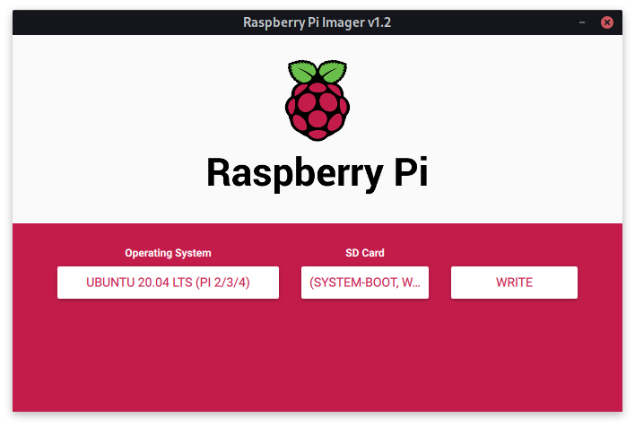

# Table of Contents

1.  [Pre-requisites](#orgd7157a2)
        1.  [Your machine](#orgba91abb)
        2.  [Raspberry](#org1067086)
2.  [Preparing for RPi OS for installation](#org0c8d0dc)
        1.  [Plug-in the SD card](#org6a636e3)
        2.  [Flash `Ubuntu` to the SD card](#org82d6b6d)
        3.  [Configure Wi-Fi and SSH](#org27bab38)
3.  [Let's get started](#org1cd169d)
        1.  [Check SSH connection](#orgcb3c733)
        2.  [Provision the machine](#org0eb4a43)
4.  [Links](#orgb623378)
5.  [What's next](#org8690685)

This project contains configurations for my Raspberry Pi (RPi)

# Pre-requisites

### Your machine

-   [X] `Arch` based OS (for example, `Manjaro`) with `yay -Sy rpi-imager wireless_tools yank` packages installed
-   [X] `Python 3.7+` and `poetry` installed

### Raspberry

-   [X] Internet connectivity: Ethernet or Wi-Fi
-   [X] SSH access enabled

# Preparing for RPi OS for installation

### Plug-in the SD card

### Flash `Ubuntu` to the SD card

Select `Operating System`, `SD Card` and click on `WRITE` button. Wait for completion of the installation and verification.

### Configure Wi-Fi and SSH

    echo ''
    echo 'Please select your WI-Fi interface and network for RPi to connect to...'
    SSID=$(ip link | grep -Po "(?<=^\d:\W).*?(?=:)" | yank | xargs -I % sh -c 'sudo iwlist % scan' | grep -Po "(?<=ESSID:\").*(?=\")" | sort | yank -l) || exit -1
    [ -n $SSID ] || exit -1
    
    echo ''
    echo "Please, enter the password to connect to ${SSID}"
    echo -n 'Password:'
    read -s PASSWORD
    echo "RPi will connect to ${SSID} network using password ${PASSWORD}."
    
    echo ''
    echo 'Please, select where system boot partition is mounted...'
    MNT_DIR=$(sudo mount | yank)
    [ -n $MTN_DIR ] || exit -1
    echo "System boot parition is mounted to ${MNT_DIR}"
    
    echo ''
    echo "Creating empty file at ${MNT_DIR}/ssh"
    [ -f ${MNT_DIR}/ssh ] || sudo tee -a ${MNT_DIR}/ssh < "" || echo exit -1
    
    echo ''
    echo ''
    echo "Setting Wi-Fi configuration to ${MNT_DIR}/network-config"
    sudo tee -a ${MNT_DIR}/network-config <<EOF
    wifis:
      wlan0:
        dhcp4: true
        access-points:
          "${SSID}":
            password: "${PASSWORD}"
    EOF

# Let's get started

### Check SSH connection

    poetry run ansible raspberry -i hosts.ini -m ping

    ➜  poetry run ansible raspberry -i hosts.ini -m ping
    192.168.1.112 | SUCCESS => {
    "ansible_facts": {
      "discovered_interpreter_python": "/usr/bin/python"
    },
    "changed": false,
    "ping": "pong"
    }

### Provision the machine

    poetry run ansible-playbook -i hosts.ini site.yaml

    
    PLAY [raspberry] *******************************************************************************************
    
    TASK [Gathering Facts] *************************************************************************************
    ok: [192.168.1.112]
    
    TASK [Update all packages to the latest version] ***********************************************************
    ok: [192.168.1.112]
    
    TASK [Install additional packages] *************************************************************************
    ok: [192.168.1.112]
    
    TASK [Alter user 'ubuntu' to allow access to 'docker'] *****************************************************
    ok: [192.168.1.112]
    
    TASK [Rebooting] *******************************************************************************************
    changed: [192.168.1.112]
    
    PLAY RECAP *************************************************************************************************
    192.168.1.112              : ok=5    changed=1    unreachable=0    failed=0    skipped=0    rescued=0    ignored=0

# Links

-   Ubuntu Raspberry Pi: <https://ubuntu.com/download/raspberry-pi>
-   Raspbian: <https://www.raspberrypi.org/downloads/raspbian/>
-   Raspbian SSH: <https://www.raspberrypi.org/documentation/remote-access/ssh/>
-   Raspbian passwordless SSH: <https://www.raspberrypi.org/documentation/remote-access/ssh/passwordless.md>
-   Ansible Documentation: <https://docs.ansible.com/>

# What's next

Todo file with ideas can be found [here](TODOs.md)

